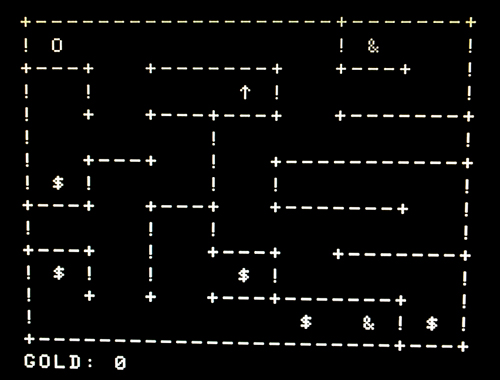

CHALLENGE: BASIC programming challenge
==========

This is a very (!) simple game that is a demonstration of coding techniques.

Press the arrow keys to move the player.  If you have the sword, you can kill one snake.  Collect all the gold
without dying to win.

- *O* player
- *&* snake
- *&#8593;* sword
- *$* gold

Press any key after game ends to start another game.

